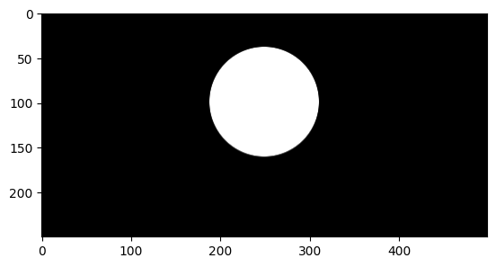
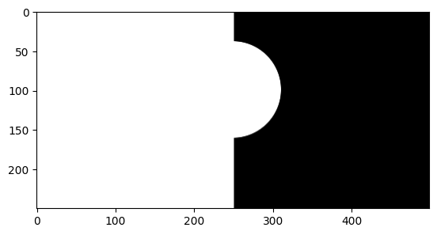

```python
import cv2 as c
from matplotlib import pyplot as plt
```


```python
round_img=c.imread('round.jpg')
```


```python
round_img.shape
```


    (250, 499, 3)


```python
plt.imshow(c.cvtColor(round_img,c.COLOR_BGR2RGB))
```


    <matplotlib.image.AxesImage at 0x1a4a1055810>


    

    


```python
bw_img=c.imread('black_white.jpg')
```


```python
bw_img.shape
```


    (250, 499, 3)


```python
plt.imshow(c.cvtColor(bw_img,c.COLOR_BGR2RGB))
```


    <matplotlib.image.AxesImage at 0x1a4a4246d90>


    

    


```python
 bw_img
```


    array([[[255, 255, 255],
            [255, 255, 255],
            [255, 255, 255],
            ...,
            [  0,   0,   0],
            [  0,   0,   0],
            [  0,   0,   0]],
    
           [[255, 255, 255],
            [255, 255, 255],
            [255, 255, 255],
            ...,
            [  0,   0,   0],
            [  0,   0,   0],
            [  0,   0,   0]],
    
           [[255, 255, 255],
            [255, 255, 255],
            [255, 255, 255],
            ...,
            [  0,   0,   0],
            [  0,   0,   0],
            [  0,   0,   0]],
    
           ...,
    
           [[255, 255, 255],
            [255, 255, 255],
            [255, 255, 255],
            ...,
            [  0,   0,   0],
            [  0,   0,   0],
            [  0,   0,   0]],
    
           [[255, 255, 255],
            [255, 255, 255],
            [255, 255, 255],
            ...,
            [  0,   0,   0],
            [  0,   0,   0],
            [  0,   0,   0]],
    
           [[255, 255, 255],
            [255, 255, 255],
            [255, 255, 255],
            ...,
            [  0,   0,   0],
            [  0,   0,   0],
            [  0,   0,   0]]], dtype=uint8)


```python
#no need to convert BGR2RGB
plt.imshow(bw_img)
```


    <matplotlib.image.AxesImage at 0x1a4a4317c50>


    

    


```python
# AND GATE
# A  B   X
# 1  1   1
# 1  0   0
# 0  1   0
# 0  0   0

img_AND=c.bitwise_and(bw_img,round_img)
```


```python
plt.imshow(c.cvtColor(img_AND,c.COLOR_BGR2RGB))
```


    <matplotlib.image.AxesImage at 0x1a4a10a6050>


    

    


```python
round_img[100][100]
```


    array([0, 0, 0], dtype=uint8)


```python
bw_img[100][100]
```


    array([255, 255, 255], dtype=uint8)


```python
img_AND[100][100]
```


    array([0, 0, 0], dtype=uint8)


```python
round_img[100][220]
```


    array([255, 255, 255], dtype=uint8)


```python
bw_img[100][220]
```


    array([255, 255, 255], dtype=uint8)


```python
img_AND[100][220]
```


    array([255, 255, 255], dtype=uint8)


```python
# OR GATE
# A  B   X
# 1  1   1
# 1  0   1
# 0  1   1
# 0  0   0
```


```python
img_OR=c.bitwise_or(bw_img,round_img)
plt.imshow(c.cvtColor(img_OR,c.COLOR_BGR2RGB))
```


    <matplotlib.image.AxesImage at 0x1a4a42a75d0>


    

    


```python
# XOR GATE
# A  B   X
# 1  1   0
# 1  0   1
# 0  1   1
# 0  0   0
```


```python
img_XOR=c.bitwise_xor(bw_img,round_img)
plt.imshow(c.cvtColor(img_XOR,c.COLOR_BGR2RGB))
```


    <matplotlib.image.AxesImage at 0x1a4a21ef5d0>


    

    


```python
round_img[100][100]
```


    array([0, 0, 0], dtype=uint8)


```python
bw_img[100][100]
```


    array([255, 255, 255], dtype=uint8)


```python
img_XOR[100][100]
```


    array([255, 255, 255], dtype=uint8)


```python
# NOT GATE
# A  X   
# 1  0   
# 0  1 

```


```python
img_bw_NOT=c.bitwise_not(bw_img)
img_round_NOT=c.bitwise_not(round_img)
```


```python
plt.imshow(c.cvtColor(img_round_NOT,c.COLOR_BGR2RGB))
```


    <matplotlib.image.AxesImage at 0x1a4a58f32d0>


    

    


```python
plt.imshow(c.cvtColor(img_bw_NOT,c.COLOR_BGR2RGB))
```


    <matplotlib.image.AxesImage at 0x1a4a5a9b750>


    

    

