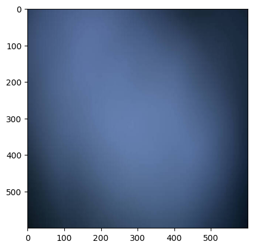
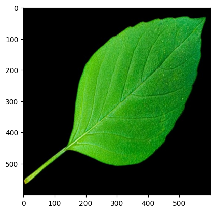
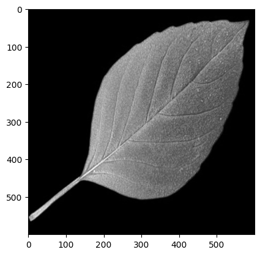
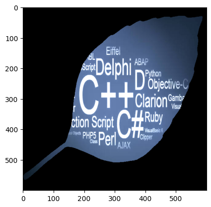

```python
import cv2 as c
from matplotlib import pyplot as plt
```


```python
img_wall=c.imread('wall.jpg')
img_text=c.imread('txt_img.jpg')
```


```python
plt.imshow(c.cvtColor(img_wall,c.COLOR_BGR2RGB))
```


    <matplotlib.image.AxesImage at 0x201e6b73310>


    

    


```python
plt.imshow(c.cvtColor(img_text,c.COLOR_BGR2RGB))
```


    <matplotlib.image.AxesImage at 0x201e8788c90>


    

    


```python
img_leaf=c.imread('leaf.jpg')
plt.imshow(c.cvtColor(img_leaf,c.COLOR_BGR2RGB))
```


    <matplotlib.image.AxesImage at 0x201e8557e90>


    

    


```python
   leaf_grayscale=c.cvtColor(img_leaf,c.COLOR_BGR2GRAY)
```


```python
plt.imshow(leaf_grayscale,cmap='gray')
```


    <matplotlib.image.AxesImage at 0x201e6aa0c90>


    

    


```python
retval,leaf_mask=c.threshold(leaf_grayscale,10,255,c.THRESH_BINARY)
```


```python
plt.imshow(leaf_mask,cmap='gray')
```


    <matplotlib.image.AxesImage at 0x201e6b70c90>


    

    


```python
add_img=c.add(img_wall,img_text,mask=leaf_mask)

```


```python
plt.imshow(c.cvtColor(add_img,c.COLOR_BGR2RGB))
```


    <matplotlib.image.AxesImage at 0x201ea028c90>


    

    

