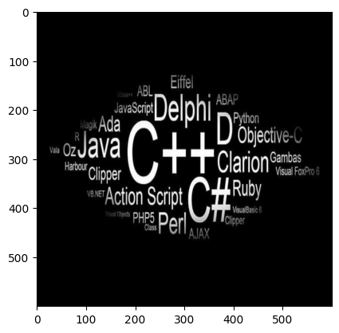
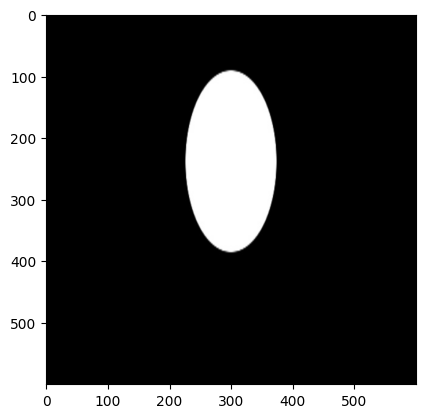
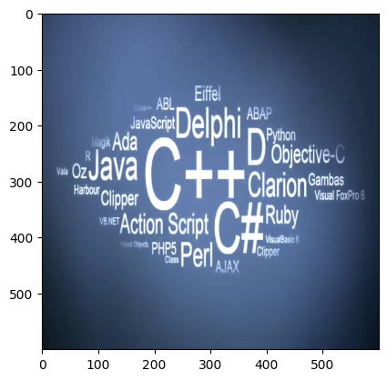
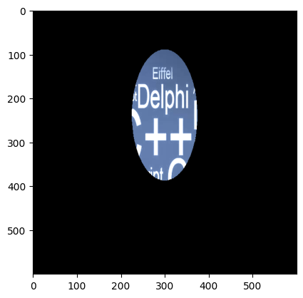
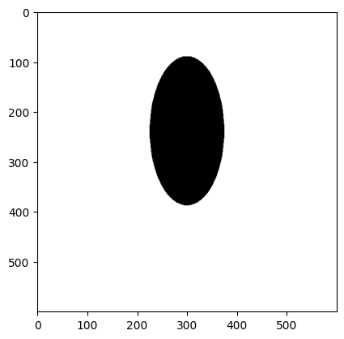
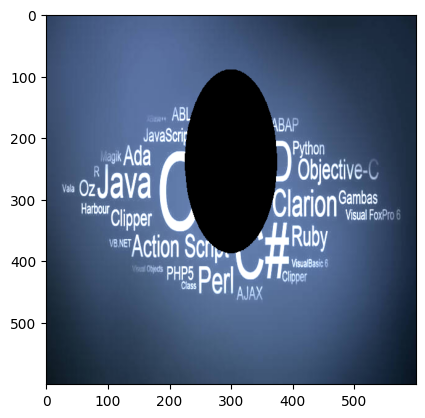

```python
import cv2 as c
from matplotlib import pyplot as plt
```


```python
img_circle=c.imread('round1.jpg')
img_wall=c.imread('wall.jpg')
img_text=c.imread('txt_img.jpg')
```


```python
plt.imshow(c.cvtColor(img_wall,c.COLOR_BGR2RGB))
```


    <matplotlib.image.AxesImage at 0x1f5a05c3890>


    

    


```python
 plt.imshow(c.cvtColor(img_text,c.COLOR_BGR2RGB))
```


    <matplotlib.image.AxesImage at 0x1f5a0639d90>


    

    


```python
plt.imshow(c.cvtColor(img_circle,c.COLOR_BGR2RGB))
```


    <matplotlib.image.AxesImage at 0x1f5a0710410>


    

    


```python
print('img_wall shape: ',img_wall.shape)
print('img_text shape: ',img_text.shape)
print('img_circle shape: ',img_circle.shape)
```

    img_wall shape:  (600, 600, 3)
    img_text shape:  (600, 600, 3)
    img_circle shape:  (600, 600, 3)
    


```python
circle_grayscale=c.cvtColor(img_circle,c.COLOR_BGR2GRAY)
circle_grayscale.shape
```


    (600, 600)


```python
circle_grayscale
```


    array([[0, 0, 0, ..., 0, 0, 0],
           [0, 0, 0, ..., 0, 0, 0],
           [0, 0, 0, ..., 0, 0, 0],
           ...,
           [0, 0, 0, ..., 0, 0, 0],
           [0, 0, 0, ..., 0, 0, 0],
           [0, 0, 0, ..., 0, 0, 0]], dtype=uint8)


```python
retval,mask=c.threshold(circle_grayscale,10,255,c.THRESH_BINARY)
```


```python
retval
```


    10.0


```python
mask
```


    array([[0, 0, 0, ..., 0, 0, 0],
           [0, 0, 0, ..., 0, 0, 0],
           [0, 0, 0, ..., 0, 0, 0],
           ...,
           [0, 0, 0, ..., 0, 0, 0],
           [0, 0, 0, ..., 0, 0, 0],
           [0, 0, 0, ..., 0, 0, 0]], dtype=uint8)


```python
mask.shape
```


    (600, 600)


```python
add_img=c.add(img_wall,img_text)
plt.imshow(c.cvtColor(add_img,c.COLOR_BGR2RGB))
```


    <matplotlib.image.AxesImage at 0x1f5a42be010>


    

    


```python
add_img=c.add(img_wall,img_text,mask=mask)
plt.imshow(c.cvtColor(add_img,c.COLOR_BGR2RGB))
```


    <matplotlib.image.AxesImage at 0x1f5a50c6010>


    

    


```python
# Not of mask 
inv_mask=c.bitwise_not(mask)
plt.imshow(inv_mask,cmap='gray')
```


    <matplotlib.image.AxesImage at 0x1f5a511e010>


    

    


```python
#inverting mask
retval,inv_mask=c.threshold(circle_grayscale,10,255,c.THRESH_BINARY_INV)
```


```python
inv_mask
```


    array([[255, 255, 255, ..., 255, 255, 255],
           [255, 255, 255, ..., 255, 255, 255],
           [255, 255, 255, ..., 255, 255, 255],
           ...,
           [255, 255, 255, ..., 255, 255, 255],
           [255, 255, 255, ..., 255, 255, 255],
           [255, 255, 255, ..., 255, 255, 255]], dtype=uint8)


```python
plt.imshow(inv_mask,cmap='gray')
```


    <matplotlib.image.AxesImage at 0x1f5a6b56010>


    

    


```python
add_img=c.add(img_wall,img_text,mask=inv_mask)
plt.imshow(c.cvtColor(add_img,c.COLOR_BGR2RGB))
```


    <matplotlib.image.AxesImage at 0x1f5a6bfe010>


    

    


```python

```
