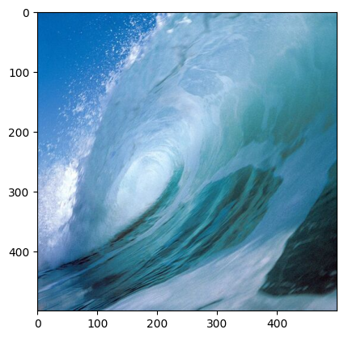
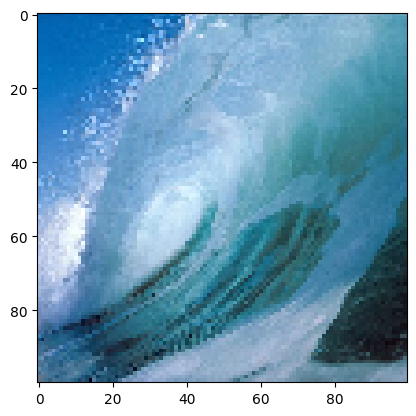
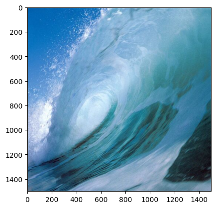
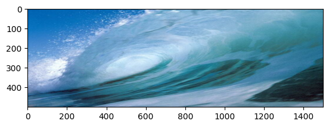
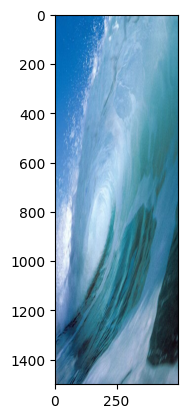
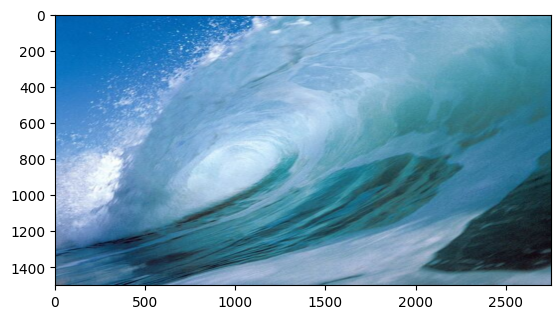
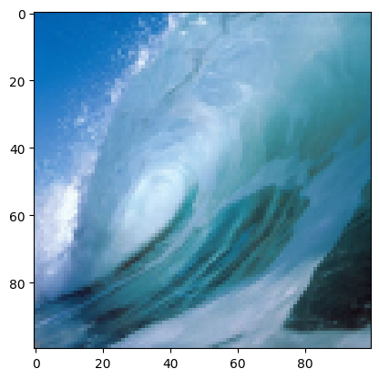

```python
import cv2 as c
from matplotlib import pyplot as plt
```


```python
water_img=c.imread('water.jpg')
water_img.shape
```


    (500, 500, 3)


```python
 plt.imshow(c.cvtColor(water_img,c.COLOR_BGR2RGB))
```


    <matplotlib.image.AxesImage at 0x1bad7d395d0>


    

    


```python
water_img[0][0]
```


    array([168,  93,   1], dtype=uint8)


```python
water_img[200][250]
```


    array([240, 215, 181], dtype=uint8)


```python
# DownScaling of the image
downscale_pct=20
wdth_dwn=int(water_img.shape[1]*downscale_pct/100)
hgth_dwn=int(water_img.shape[0]*downscale_pct/100)
dimension_down=(wdth_dwn,hgth_dwn)
dimension_down
```


    (100, 100)


```python
img_resize_dwn.shape
```


    (100, 100, 3)


```python
img_resize_dwn=c.resize(water_img,dimension_down)
plt.imshow(c.cvtColor(img_resize_dwn,c.COLOR_BGR2RGB))
```


    <matplotlib.image.AxesImage at 0x1bada2795d0>


    

    


```python
# UpScaling of the image:
#Setting the amount of upscale
upscale=300
wdth_up=int(water_img.shape[1]*upscale/100)
hgth_up=int(water_img.shape[0]*upscale/100)
dimension_up=(wdth_up,hgth_up)
img_resize_up=c.resize(water_img,dimension_up)
img_resize_up.shape
```


    (1500, 1500, 3)


```python
plt.imshow(c.cvtColor(img_resize_up,c.COLOR_BGR2RGB))
```


    <matplotlib.image.AxesImage at 0x1bada6b1510>


    

    


```python
# Width Increase with height fix
resize_pct=300
height=water_img.shape[0]
adj_wdth=int(water_img.shape[1]*resize_pct/100)
adj_dimension=(adj_wdth,height)
image_resize=c.resize(water_img,adj_dimension)
image_resize.shape
```


    (500, 1500, 3)


```python
plt.imshow(c.cvtColor(image_resize,c.COLOR_BGR2RGB))
```


    <matplotlib.image.AxesImage at 0x1badd0215d0>


    

    


```python
# Height increase with width fix
width=water_img.shape[1]
adj_hgth=int(water_img.shape[0]*resize_pct/100)
adj_dimensions=(width,adj_hgth)
image_resize=c.resize(water_img,adj_dimensions)
image_resize.shape
```


    (1500, 500, 3)


```python
plt.imshow(c.cvtColor(image_resize,c.COLOR_BGR2RGB))
```


    <matplotlib.image.AxesImage at 0x1badd5395d0>


    

    


```python
resize_hgth_pct=300
resize_wdth_pct=550
adj_hgth=int(water_img.shape[0]*resize_hgth_pct/100)
adj_wdth=int(water_img.shape[1]*resize_wdth_pct/100)
adj_dimension=(adj_wdth,adj_hgth)
img_resize=c.resize(water_img,adj_dimension)
img_resize.shape
```


    (1500, 2750, 3)


```python
plt.imshow(c.cvtColor(img_resize,c.COLOR_BGR2RGB))
```


    <matplotlib.image.AxesImage at 0x1bada7e6d90>


    

    


```python
# using interpolation=c.Inter_AREA for downscale
downscale_pct=20
wdth_dwn=int(water_img.shape[1]*downscale_pct/100)
hgth_dwn=int(water_img.shape[0]*downscale_pct/100)
dimension_down=(wdth_dwn,hgth_dwn)
img_resize_dwn=c.resize(water_img,dimension_down,interpolation=c.INTER_AREA)
plt.imshow(c.cvtColor(img_resize_dwn,c.COLOR_BGR2RGB))
```


    <matplotlib.image.AxesImage at 0x1bada4b9950>


    

    


```python
# using interpolation=c.Inter_CUBIC for upscale
upscale=300
wdth_up=int(water_img.shape[1]*upscale/100)
hgth_up=int(water_img.shape[0]*upscale/100)
dimension_up=(wdth_up,hgth_up)
img_resize_up=c.resize(water_img,dimension_up,interpolation=c.INTER_CUBIC)
plt.imshow(c.cvtColor(img_resize_up,c.COLOR_BGR2RGB))
```


    <matplotlib.image.AxesImage at 0x1bada7f95d0>


    

    

