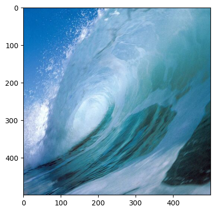
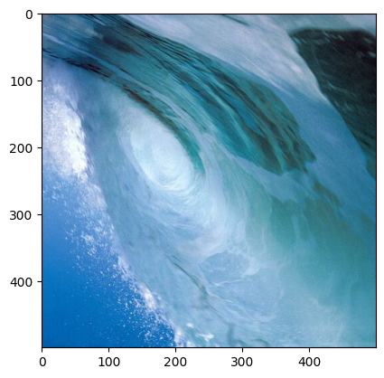
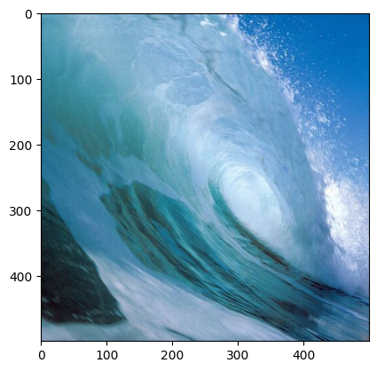
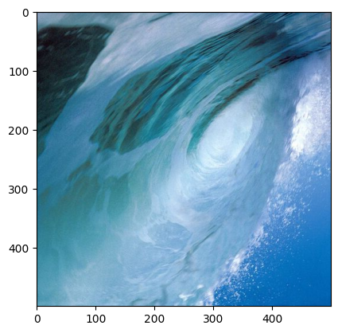

```python
import cv2 as c
from matplotlib import pyplot as plt
import numpy as np
```


```python
water_img=c.imread('water.jpg')
plt.imshow(c.cvtColor(water_img,c.COLOR_BGR2RGB))
```


    <matplotlib.image.AxesImage at 0x2a1882b2450>


    

    


```python
water_img.shape
```


    (500, 500, 3)


```python
height,width=water_img.shape[:2]
```


```python
cen=(width/2,height/2)
```


```python
rot=c.getRotationMatrix2D(cen,180,1)
res=c.warpAffine(water_img,rot,(width,height))
plt.imshow(c.cvtColor(res,c.COLOR_BGR2RGB))
```


    <matplotlib.image.AxesImage at 0x2a18b5f2210>


    

    


```python
rot
```


    array([[-1.0000000e+00,  1.2246468e-16,  5.0000000e+02],
           [-1.2246468e-16, -1.0000000e+00,  5.0000000e+02]])


```python
#Fliping by keeping X coordinate fixed
x_flip=c.flip(water_img,0)
plt.imshow(c.cvtColor(x_flip,c.COLOR_BGR2RGB))
```


    <matplotlib.image.AxesImage at 0x2a1882ea210>


    

    


```python
#Fliping by keeping Y coordinate fixed
y_flip=c.flip(water_img,1)
plt.imshow(c.cvtColor(y_flip,c.COLOR_BGR2RGB))
```


    <matplotlib.image.AxesImage at 0x2a18b648850>


    

    


```python
#Fliping by changing both x and y coordinate 
xy_flip=c.flip(water_img,-1)
plt.imshow(c.cvtColor(xy_flip,c.COLOR_BGR2RGB))
```


    <matplotlib.image.AxesImage at 0x2a18b760850>


    

    

