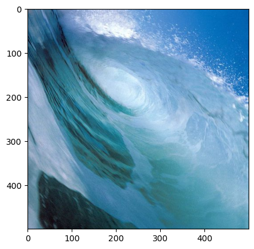

```python
import cv2 as c
from matplotlib import pyplot as plt
import numpy as np
```


```python
water_img=c.imread('water.jpg')
plt.imshow(c.cvtColor(water_img,c.COLOR_BGR2RGB))
```


    <matplotlib.image.AxesImage at 0x26801ebecd0>


    

    


```python
height,width= water_img.shape[:2]
(width,height)
```


    (500, 500)


```python
transformation_matrix=np.float32([[1,0, 100],[0,1,40]])
transformed_img=c.warpAffine(water_img,transformation_matrix,(width,height))
plt.imshow(c.cvtColor(transformed_img,c.COLOR_BGR2RGB))
```


    <matplotlib.image.AxesImage at 0x268057c1950>


    

    


```python
transformation_matrix=np.float32([[1,0, -50],[0,1,-120]])
transformed_img=c.warpAffine(water_img,transformation_matrix,(width,height))
plt.imshow(c.cvtColor(transformed_img,c.COLOR_BGR2RGB))
```


    <matplotlib.image.AxesImage at 0x2680580e410>


    

    


```python
#Rotaion of image
rotated_img=c.rotate(water_img,c.ROTATE_90_CLOCKWISE)
plt.imshow(c.cvtColor(rotated_img,c.COLOR_BGR2RGB))
```


    <matplotlib.image.AxesImage at 0x268059c5250>


    

    


```python
rotated_img=c.rotate(water_img,c.ROTATE_90_COUNTERCLOCKWISE)
plt.imshow(c.cvtColor(rotated_img,c.COLOR_BGR2RGB))
```


    <matplotlib.image.AxesImage at 0x26805a40210>


    

    


```python

```
